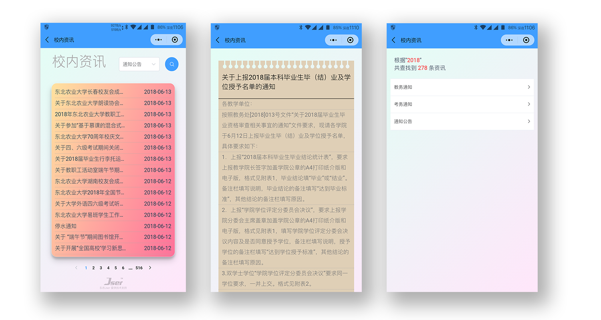
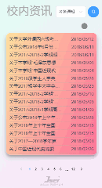

# 校内资讯 - 前端部分

### 简介
校内资讯是基于东农教务处及官网资讯的移动端展示平台

> 项目预览地址:point_right: [点我预览](https://neau-news.xiaonei.io/index.html#/) (请在移动端查看)
- 前端页面

- 和一些简单的小动画:blush:


### 目录结构
```bash
src
├── assets  # 项目中的图标目录
├── components  # 组件目录
|   ├── detail.vue  # 资讯详情页
│   ├── pagination.vue  # 主页
│   └── search.vue  # 搜索结果页
├── css
|   └── main.css # 组件的主要样式表
├── router
|   └── index.js # vue-router配置文件
├── main.js
└── App.vue
```

### 本地开发
```bash
git clone  https://github.com/JserShadow/news-front.git
cd news-front
npm i
npm run dev
# 浏览器访问  http://localhost:8080  即可
```

### 生产环境
```bash
npm run build
```

### 项目实现思路
- 该项目分为三个部分
  - 前端部分: 负责请求并展示已有数据
  - [后端部分](https://github.com/JserShadow/egg-news): 负责向前端提供数据和定时爬取最新数据
  - [爬虫部分](https://github.com/JserShadow/neau-news-crawler): 负责生产环境搭建时爬取到历史所有数据(一次性程序)

### 数据呈现方式
由于官网部分的数据动辄几千条，让它进入页面时一次加载完是不现实的，因此我们选择分批加载数据的方式，就有了以下两种解决方案：
1. 无限滚动
2. 分页

在校园资讯早期版本我们采用了无限滚动，但是由于用户体验不好，更改为分页式数据呈现。

### 处理跨域问题
由于vue-cli监听8080端口，Egg.js监听7001端口，根据同源策略，向后端发送请求成为跨域行为。我们使用Vue中的`proxyTable`处理跨域问题。
```js
// /config/index.js
proxyTable: {
      '/jwc/*': { // key为需要处理的请求的路由(/*表示它父路由的所有子路由)
        target: 'http://localhost:7001',
        changeOrigin: true
      },
}
```
### 处理静态资源
- 在生产环境中，由于服务器带宽限制，静态资源加载极慢
- 使用`CDN加速技术`可以解决此问题
  - 使用又拍云的CDN加速服务
  - 使用`FileZilla`搭建FTP服务器
  - 上传静态资源到该服务器
  - 修改静态资源路径

